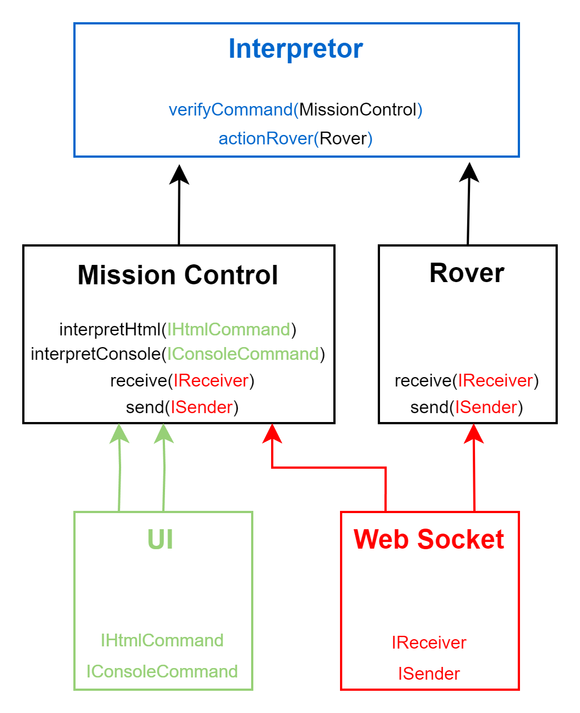

# mars-rover-ts

## Schéma d'architecture :

## Lancer l'application :

Fichier de lancement :
src/main.rover.ts
src/main.missioncontrol.ts

Pour lancer, utiliser ts-node

### A faire
Mettre une interface sur l'interpreteur afin de supprimer la dépendance direct à l'interpreteur en injectant l'interface donc interpreteur hérite. 
